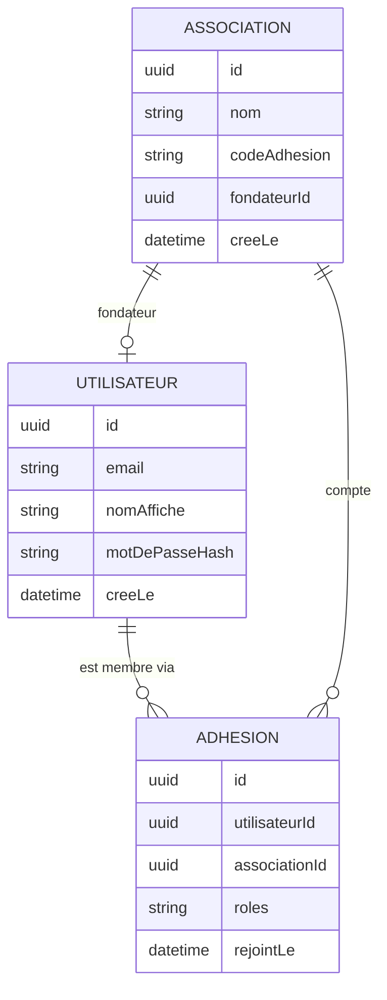
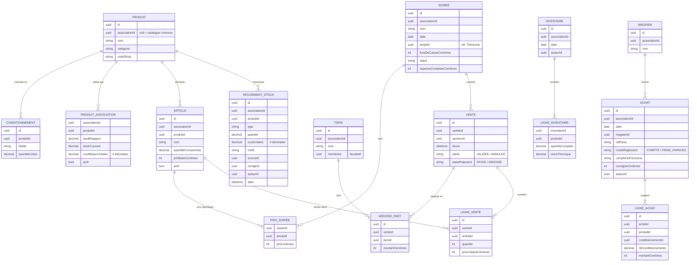
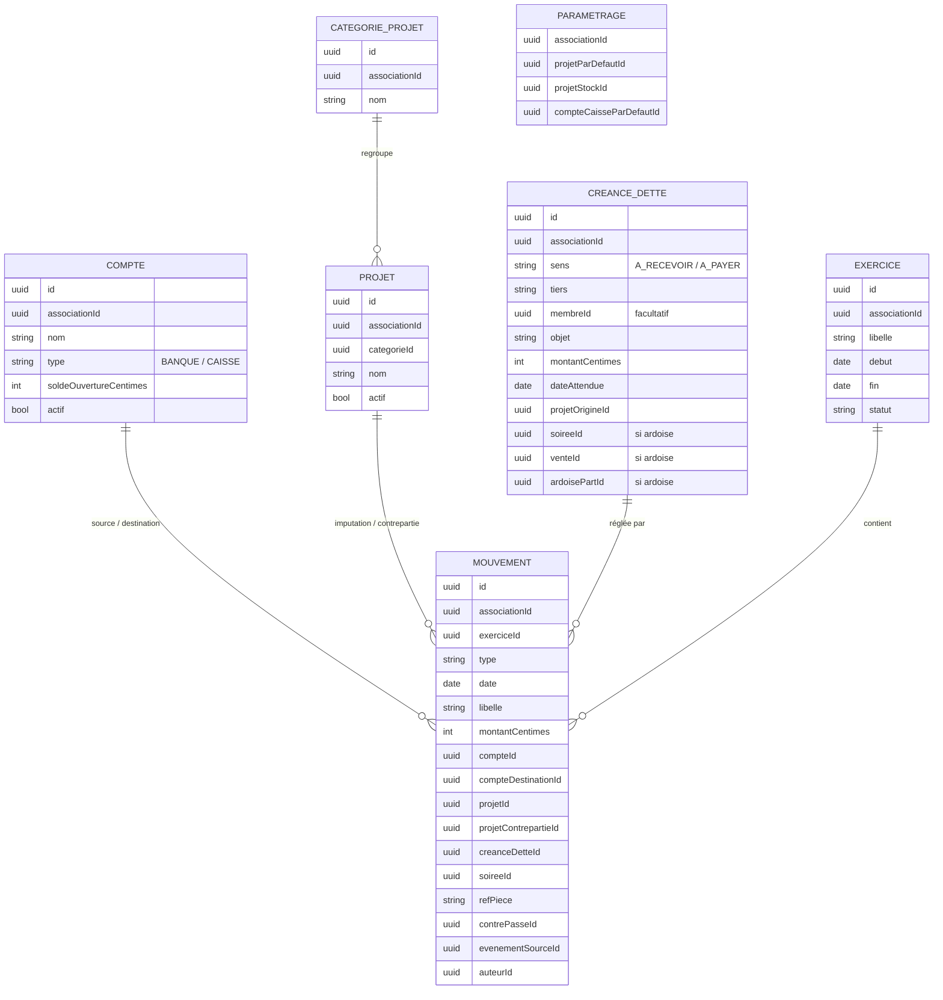

# Ardoise — Cahier des charges

> UE Projet d'intégration de développement — EAFC Namur-Cadets — 2026-2027
> Auteur : Alex Tadino — Chargé de cours : Yolan Fery
> Version : **1.2** — septembre 2026
> Justifications des choix structurants : `annexe-justifications.md`.
> Architecture à deux services (Identité + Gestion, ce dernier contenant les modules Stock et Trésorerie), **validée par le chargé de cours le 24/09/2026**. Voir 9.2, 9.4 et 10.3.

---

## 1. Présentation du projet

### 1.1 Contexte

De nombreuses associations (unités scoutes, cercles étudiants, clubs sportifs, comités des fêtes, maisons de jeunes) tiennent un bar et financent leurs activités par des événements : soirées, brunchs, ventes, tournois. Leur gestion est assurée par des bénévoles, qui se relaient d'une année à l'autre, avec des outils génériques : tableurs, carnets, caisse en espèces.

### 1.2 Problématique

Trois activités y sont suivies séparément : le **stock** (achats, réserve), les **ventes au comptoir** (rarement enregistrées à l'unité) et la **trésorerie** (comptes, caisse, frais avancés, sommes dues).

Cette séparation entraîne des saisies multiples d'une même opération et aucun lien entre les boissons sorties et l'argent encaissé. Quatre questions restent alors sans réponse simple : combien a rapporté cette soirée ? Que vaut le stock aujourd'hui ? Pourquoi la caisse ne tombe-t-elle pas juste ? Qui doit de l'argent à qui ?

### 1.3 Solution proposée

**Ardoise** est une application web multi-associations qui réunit, dans un même outil, la caisse du comptoir, la gestion du stock et la trésorerie par projets. Chaque opération réelle (un ticket d'achat, une vente, un comptage) n'est saisie qu'une seule fois ; ses conséquences sur le stock et sur l'argent sont calculées automatiquement.

### 1.4 Objectifs

- **O1** — Une seule saisie par opération réelle.
- **O2** — Connaître à tout moment le stock théorique de chaque produit et l'écart avec le dernier comptage.
- **O3** — Connaître la recette, le coût et le résultat de chaque soirée et de chaque projet.
- **O4** — Garantir la cohérence des soldes (comptes, stock, créances, dettes) sans contrôle manuel.
- **O5** — Tracer chaque opération : qui, quand, quoi.
- **O6** — Servir plusieurs associations sur la même plateforme, chacune ne voyant que ses propres données.

---

## 2. Périmètre

### 2.1 Fonctionnalités couvertes

| Domaine | Contenu |
|---|---|
| Comptes et associations | Création de compte, création d'une association, adhésion par code, membres et rôles |
| Catalogue | Catalogue commun de produits courants, produits propres à chaque association, articles de vente (à l'unité ou au verre), conditionnements d'achat |
| Stock | Achats, reports d'ouverture, ventes, sorties (offert, casse, perte), inventaires, stock théorique, écarts, alertes de réapprovisionnement |
| Caisse et soirées | Ouverture de soirée, saisie des ventes par serveur, ventes à l'ardoise et règlement des ardoises, annulation, clôture avec comptage des espèces |
| Trésorerie | Comptes, projets, mouvements, frais avancés, créances et dettes, consignes, résultats par projet, situation nette |
| Exercices | Clôture d'un exercice et report sur le suivant |

### 2.2 Hors périmètre

- Traitement des paiements électroniques (carte, application de paiement) et enregistrement du moyen de paiement des ventes
- Impression de tickets
- Vérification de l'adresse e-mail à l'inscription
- Changement rapide de serveur sur un appareil partagé (code court)
- Fonctionnement hors ligne de la caisse
- Export comptable et pièces justificatives numérisées
- Import automatique des relevés bancaires
- Comptabilité légale (plan comptable, comptes annuels) et gestion de la TVA
- Facturation des associations utilisatrices
- Application mobile native (l'interface web reste utilisable sur tablette et smartphone)

---

## 3. Glossaire

| Terme | Définition |
|---|---|
| **Association** | Organisation utilisatrice de la plateforme. Toutes ses données lui sont propres. |
| **Membre** | Utilisateur appartenant à une association, avec un ou plusieurs rôles. |
| **Fondateur** | Membre ayant créé l'association ; statut protégé (RG-ORG-07 à 10, 13). |
| **Exercice** | Période de gestion (généralement une année) au terme de laquelle les soldes sont reportés. |
| **Produit** | Bien acheté et stocké, exprimé dans une unité de stock (bouteille, canette, brique…). |
| **Conditionnement** | Forme sous laquelle un produit est acheté (bac de 24, pack de 6…), convertie en unités de stock. |
| **Article** | Ce qui est vendu au comptoir ; consomme une quantité définie d'un produit (ex. un verre = 1/20 de bouteille). |
| **Mouvement de stock** | Entrée ou sortie de stock d'un produit ; le stock est la somme de ces mouvements. |
| **Sortie** | Mouvement de stock sans vente : offert, casse, perte. |
| **Inventaire** | Comptage physique du stock, qui produit un ajustement égal à l'écart constaté. |
| **Coût moyen pondéré (CMP)** | Coût unitaire d'un produit, recalculé à chaque entrée en stock. |
| **Soirée** | Période d'ouverture d'une caisse, pendant laquelle les ventes sont enregistrées. |
| **Fond de caisse** | Espèces présentes dans la caisse à l'ouverture d'une soirée. |
| **Ardoise** | Consommation servie sans être payée, mise au nom d'une personne qui règlera plus tard ; elle crée une créance de l'association envers cette personne. |
| **Compte** | Réserve d'argent de l'association : compte bancaire ou caisse en espèces. |
| **Projet** | Axe d'imputation des recettes et dépenses (un événement, une activité, un poste). |
| **Refacturation interne** | Transfert de coût d'un projet vers un autre, sans mouvement d'argent. |
| **Frais avancés** | Dépense payée par un bénévole avec son propre argent, qui crée une dette de l'association envers lui. À ne pas confondre avec l'ardoise, où c'est une personne qui doit à l'association. |
| **Créance / dette** | Somme à recevoir d'un tiers / à payer à un tiers. |
| **Consigne** | Montant payé pour des vidanges (bouteilles, casiers), récupérable auprès du magasin. |
| **Situation nette** | Valeur totale de l'association : comptes + stock + créances − dettes. |

---

## 4. Acteurs et rôles

### 4.1 Comptes et associations

- Toute personne peut créer un compte utilisateur.
- Tout utilisateur peut **créer une association** ; il en devient administrateur et fondateur.
- Tout utilisateur peut **rejoindre** une association grâce à son code d'adhésion.
- Un même compte peut être membre de plusieurs associations, avec des rôles différents dans chacune.
- Aucun rôle ne donne accès aux données de toutes les associations.

### 4.2 Rôles au sein d'une association

| Rôle | Mission |
|---|---|
| **Administrateur** | Dispose de tous les autres rôles ; gère en plus les membres, les rôles, le code d'adhésion et le paramétrage de l'association. |
| **Gestionnaire de stock** | Tient le catalogue, encode les achats et les sorties, réalise les inventaires ; ouvre, encaisse et clôture les soirées. |
| **Trésorier** | Tient les comptes, les projets, les mouvements, les créances et les dettes. |
| **Serveur** | Encaisse au comptoir pendant une soirée ouverte. |
| **Lecteur** | Consulte l'ensemble des données de l'association sans pouvoir les modifier. |

Le **fondateur** n'est pas un rôle mais un statut porté par un administrateur.

### 4.3 Matrice des droits

| Fonction | Administrateur | Gestionnaire de stock | Trésorier | Serveur | Lecteur |
|---|:-:|:-:|:-:|:-:|:-:|
| Paramétrer l'association | ✅ | | | | |
| Gérer les membres, les rôles et le code d'adhésion | ✅ | | | | |
| Ouvrir une soirée | ✅ | ✅ | | | |
| Composer la carte d'une soirée et fixer ses prix | ✅ | ✅ | | | |
| Encaisser pendant une soirée ouverte | ✅ | ✅ | | ✅ | |
| Clôturer une soirée | ✅ | ✅ | | | |
| Gérer le catalogue | ✅ | ✅ | | | 👁 |
| Encoder un achat ou une sortie | ✅ | ✅ | | | 👁 |
| Réaliser un inventaire | ✅ | ✅ | | | 👁 |
| Consulter le stock, les écarts et les alertes | ✅ | ✅ | 👁 | | 👁 |
| Consulter le bilan d'une soirée clôturée | ✅ | ✅ | 👁 | | 👁 |
| Gérer comptes, projets et mouvements | ✅ | | ✅ | | 👁 |
| Gérer créances et dettes | ✅ | | ✅ | | 👁 |
| Consulter résultats et situation nette | ✅ | | ✅ | | 👁 |

✅ lecture et écriture · 👁 lecture seule

---

## 5. Règles de gestion

Chaque règle est numérotée pour être référencée dans les user stories, le code et les tests.

### 5.1 Associations, membres et rôles (RG-ORG)

| N° | Règle |
|---|---|
| RG-ORG-01 | Tout utilisateur authentifié peut créer une association. Il en devient administrateur et fondateur. |
| RG-ORG-02 | Un utilisateur peut être membre de plusieurs associations ; ses rôles sont propres à chaque association. |
| RG-ORG-03 | Chaque association possède un code d'adhésion, généré aléatoirement, visible uniquement par ses administrateurs. |
| RG-ORG-04 | Un administrateur peut régénérer le code d'adhésion ; l'ancien code cesse immédiatement d'être valable. |
| RG-ORG-05 | Un utilisateur qui rejoint une association avec un code valide y entre **sans aucun rôle** : il ne voit aucune donnée tant qu'un administrateur ne lui a pas attribué de rôle. |
| RG-ORG-06 | Un administrateur attribue ou retire les rôles Gestionnaire de stock, Trésorier, Serveur et Lecteur, et exclut un membre. |
| RG-ORG-07 | Seul le **fondateur** attribue ou retire le rôle Administrateur. |
| RG-ORG-08 | Le fondateur ne peut ni être exclu, ni perdre le rôle Administrateur, du fait d'un autre administrateur. |
| RG-ORG-09 | Le fondateur peut transférer son statut à un autre administrateur de l'association. |
| RG-ORG-10 | Le fondateur ne peut pas quitter l'association sans avoir transféré son statut. |
| RG-ORG-11 | Une association compte toujours au moins un administrateur : toute opération qui retirerait le dernier est refusée. |
| RG-ORG-12 | Tout membre peut quitter l'association de lui-même, à l'exception du fondateur (RG-ORG-10). |
| RG-ORG-13 | Seul le fondateur peut supprimer l'association. La suppression exige une confirmation explicite et efface définitivement toutes ses données. |
| RG-ORG-14 | Les droits d'un membre sont l'union des droits de ses rôles ; le rôle Administrateur inclut tous les autres. |
| RG-ORG-15 | Un utilisateur n'accède qu'aux données des associations dont il est membre. L'association concernée par une requête est vérifiée côté serveur à partir de l'identité de l'utilisateur, jamais sur la seule foi d'une valeur fournie par le client. |
| RG-ORG-16 | Chaque opération est enregistrée avec son auteur et sa date. |

### 5.2 Catalogue (RG-CAT)

| N° | Règle |
|---|---|
| RG-CAT-01 | La plateforme fournit un **catalogue commun** de produits courants (bières, softs, alcools, vins), disponible pour toutes les associations. |
| RG-CAT-02 | Le catalogue commun est livré et maintenu avec l'application (données d'initialisation versionnées) ; aucune association ne peut le modifier. |
| RG-CAT-03 | Une association peut créer ses propres produits, visibles uniquement par elle. |
| RG-CAT-04 | Une association choisit les produits qu'elle utilise, communs ou propres. Seuls ceux-ci apparaissent dans ses achats, son stock et ses inventaires. |
| RG-CAT-05 | L'activation ou la création d'un produit crée automatiquement l'article de vente correspondant, d'une unité de stock ; il ne reste qu'à fixer son prix. Cet article peut ensuite être modifié, désactivé ou complété par d'autres articles du même produit. |
| RG-CAT-06 | Le stock, le coût, le seuil de réapprovisionnement et les prix de vente sont toujours propres à l'association, y compris pour un produit du catalogue commun. |
| RG-CAT-07 | Un produit a une **unité de stock** et un ou plusieurs **conditionnements d'achat** exprimés dans cette unité (ex. bac de 24, pack de 6). |
| RG-CAT-08 | Un article consomme une quantité d'**un seul** produit, exprimée en unité de stock, éventuellement fractionnaire (ex. « Verre de pastis » = 1/20 de bouteille). |
| RG-CAT-09 | Un même produit peut alimenter plusieurs articles (ex. « Verre de vin » et « Bouteille de vin »). |
| RG-CAT-10 | Un article a un **prix de vente de base**, qui peut être remplacé par un prix spécifique pour une soirée donnée. |
| RG-CAT-11 | Un produit ou un article ayant déjà servi n'est jamais supprimé, seulement désactivé. |
| RG-CAT-12 | Un article peut être **sans stock** : il ne consomme aucun produit et ne génère aucun mouvement de stock (entrée de soirée, ticket de brunch, place d'activité, participation). Sa vente est une recette au même titre qu'une autre. |
| RG-CAT-13 | Chaque association compose la **carte de sa caisse** : la liste des articles affichés à l'écran de vente, dans l'ordre choisi. Les autres articles restent accessibles par une recherche, sans encombrer l'écran. |

### 5.3 Stock (RG-STK)

| N° | Règle |
|---|---|
| RG-STK-01 | Le stock d'un produit n'est jamais saisi directement : il est la **somme de ses mouvements**. |
| RG-STK-02 | Types de mouvement : report d'ouverture, achat, vente, sortie (offert, casse, perte), ajustement d'inventaire. |
| RG-STK-03 | Un mouvement enregistré n'est ni modifié ni supprimé ; une erreur se corrige par un mouvement inverse lié au mouvement corrigé. |
| RG-STK-04 | Un achat s'encode par ticket : date, magasin, référence du ticket, mode de règlement (compte ou frais avancés), et une ligne par produit (conditionnement, nombre de conditionnements, montant payé). La quantité en unités est calculée. |
| RG-STK-05 | La consigne d'un ticket est encodée séparément du montant des produits ; elle n'entre ni dans le stock ni dans son coût. |
| RG-STK-06 | Le coût unitaire d'un produit est le **coût moyen pondéré**, recalculé à chaque entrée : (stock × coût actuel + quantité entrée × prix unitaire d'entrée) ÷ (stock + quantité entrée). Il est conservé en décimal exact à 4 décimales (RG-TRE-26), jamais arrondi au centime entre deux calculs. |
| RG-STK-07 | Toute sortie (vente, offert, casse, perte, ajustement négatif) est valorisée au coût moyen pondéré du produit au moment de la sortie. |
| RG-STK-08 | Si le stock d'un produit est nul ou négatif au moment d'une entrée, la formule de RG-STK-06 n'est pas applicable : le coût moyen devient simplement le prix unitaire de l'entrée. |
| RG-STK-09 | Le stock peut être fractionnaire (bouteille entamée) ; l'inventaire accepte des quantités décimales. |
| RG-STK-10 | Une vente n'est **jamais bloquée** par un stock théorique insuffisant. Un stock négatif est signalé au gestionnaire de stock. |
| RG-STK-11 | Un inventaire enregistre la quantité réellement comptée de chaque produit ; l'application crée un ajustement égal à (quantité comptée − stock théorique) et conserve l'écart pour analyse. |
| RG-STK-12 | Un produit non compté lors d'un inventaire n'est pas ajusté (inventaire partiel autorisé). |
| RG-STK-13 | Un inventaire ne peut pas être réalisé tant qu'une soirée est ouverte : les ventes en cours fausseraient le comptage. |
| RG-STK-14 | Une association qui démarre saisit un **inventaire d'ouverture** : quantité et coût unitaire de chaque produit déjà en cave. Il est enregistré en mouvements de report et ne constitue pas une dépense. |
| RG-STK-15 | Une sortie peut être encodée pendant une soirée depuis la caisse, ou hors soirée par un gestionnaire de stock. Le motif est obligatoire. |
| RG-STK-16 | Une alerte de réapprovisionnement est levée lorsque le stock théorique d'un produit passe sous son seuil. |
| RG-STK-17 | À l'ouverture d'un exercice, le stock restant est repris par un mouvement de report, valorisé au coût moyen pondéré de clôture. Un report n'est pas une dépense de l'exercice. |

### 5.4 Soirées et caisse (RG-SOI)

| N° | Règle |
|---|---|
| RG-SOI-01 | Toute vente a lieu dans une **soirée ouverte**. Une soirée a un nom, une date et, facultativement, un projet. |
| RG-SOI-02 | Une soirée peut être créée et ouverte en quelques secondes, avec des valeurs par défaut (nom, date, projet, compte caisse, carte et prix préremplis). |
| RG-SOI-03 | Une soirée sans projet est imputée au **projet par défaut** de l'association. |
| RG-SOI-04 | Seuls un gestionnaire de stock ou un administrateur ouvrent une soirée. L'ouverture comprend **obligatoirement** une étape de fixation des prix : l'application présente la carte avec les prix de base de chaque article, que l'ouvreur confirme ou modifie. Les prix ainsi fixés sont ceux de la soirée. |
| RG-SOI-05 | Cette étape est préremplie : confirmer sans rien changer suffit, ce qui garde l'ouverture d'un bar ordinaire quasi immédiate (RG-SOI-02). |
| RG-SOI-06 | Les prix et la composition de la carte de la soirée restent modifiables tant que la soirée est ouverte, par un gestionnaire de stock ou un administrateur uniquement. Un serveur ne peut ni ouvrir une soirée, ni choisir les articles, ni fixer un prix : il encaisse. |
| RG-SOI-07 | Le prix appliqué à une vente est figé au moment de la vente : modifier un prix en cours de soirée ne change aucune vente déjà validée. |
| RG-SOI-08 | À l'ouverture, le **compte caisse** qui recevra les espèces est choisi (celui par défaut est présélectionné) et le **fond de caisse** est saisi. |
| RG-SOI-09 | Plusieurs serveurs peuvent encaisser simultanément sur une même soirée, depuis des appareils différents. Plusieurs soirées peuvent être ouvertes en même temps (caisses physiques distinctes). |
| RG-SOI-10 | Une vente est composée dans une **commande en cours**, visible par le serveur (articles, quantités, total), puis validée en une fois. Une commande non validée n'a aucun effet. |
| RG-SOI-11 | L'écran de vente présente la carte de la caisse (RG-CAT-13) ; un bouton donne accès aux autres articles de l'association. |
| RG-SOI-12 | Le serveur ne voit que sa commande en cours et sa dernière vente validée. Il n'a accès ni au total de la soirée, ni aux ventes des autres serveurs. |
| RG-SOI-13 | Chaque vente enregistre le serveur qui l'a validée, l'heure, les articles, les quantités, le prix appliqué et son **statut de paiement** (payée ou à l'ardoise). |
| RG-SOI-14 | Le moyen de paiement d'une vente payée (espèces, virement, autre) n'est pas enregistré ; seule la distinction entre vente payée et vente à l'ardoise l'est. |
| RG-SOI-15 | Un serveur peut annuler **sa propre dernière vente** tant que la soirée est ouverte. Un gestionnaire de stock peut annuler n'importe quelle vente d'une soirée ouverte. Une vente annulée reste visible comme telle. |
| RG-SOI-16 | Depuis la caisse, un serveur peut encoder une sortie (offert, casse, perte), avec motif obligatoire. |
| RG-SOI-17 | Seul un gestionnaire de stock clôture la soirée, en saisissant les espèces comptées. Aucune vente ni annulation n'est possible ensuite. |
| RG-SOI-18 | À la clôture sont calculés : la **recette totale** (toutes les ventes, payées ou à l'ardoise), le **total mis à l'ardoise**, les **espèces provenant des ventes** (espèces comptées − fond de caisse − règlements d'ardoises encaissés pendant la soirée, ceux-ci étant déjà dans la caisse), le montant **attendu par virement** (ventes payées − espèces provenant des ventes) et le **coût du stock consommé** (ventes et sorties de la soirée). |
| RG-SOI-19 | Le trésorier rattache ensuite à la soirée les virements reçus. **Écart de caisse** = ventes payées − espèces provenant des ventes − virements rattachés. Ni les ventes à l'ardoise, ni les règlements d'ardoises encaissés ce soir-là n'entrent dans ce calcul. |
| RG-SOI-20 | Une soirée clôturée n'est plus modifiable. Une erreur constatée après clôture se corrige par un mouvement de stock et un mouvement de trésorerie. |

### 5.5 Ardoises (RG-ARD)

| N° | Règle |
|---|---|
| RG-ARD-01 | Toute vente est payée par défaut : le serveur valide la commande sans saisir aucun nom. Un bouton distinct permet de la mettre **à l'ardoise**, et c'est seulement dans ce cas qu'une personne doit être désignée. |
| RG-ARD-02 | Ce bouton est disponible dans toute soirée, qu'elle soit rattachée à un projet ou créée à la volée. |
| RG-ARD-03 | Une vente à l'ardoise produit exactement les mêmes mouvements de stock qu'une vente payée : la marchandise est sortie et son coût est imputé à la soirée. |
| RG-ARD-04 | La personne est choisie parmi les membres de l'association ou parmi les tiers déjà connus ; un nouveau nom peut être saisi librement et devient un tiers réutilisable, afin d'éviter les doublons d'orthographe. |
| RG-ARD-05 | Une vente à l'ardoise peut être **répartie entre plusieurs personnes** : le serveur en désigne une ou plusieurs, et le montant est divisé entre elles. |
| RG-ARD-06 | Par défaut, le montant est réparti à parts égales ; le serveur peut ajuster chaque part. La somme des parts doit égaler le montant de la vente, au centime près : les centimes restants d'une division inexacte sont attribués à la première part. |
| RG-ARD-07 | Chaque part crée une **créance à recevoir** distincte, au nom de la personne concernée, rattachée à la vente, à la soirée et à son projet. Chacune se règle indépendamment des autres. |
| RG-ARD-08 | Cette créance est créée **au moment de la vente**, par le module Trésorerie, appelé par le module Stock dans la même transaction (section 9.4). La créance est l'unique source du solde d'une personne : le module Stock ne tient aucun compteur de dette. |
| RG-ARD-09 | Les ardoises d'une même personne s'additionnent : l'application présente à tout moment le solde dû par chaque personne. |
| RG-ARD-10 | L'annulation d'une vente à l'ardoise (RG-SOI-15) annule toutes les créances qu'elle a créées, dans la même transaction que l'annulation. Elle est refusée dès qu'une de ces créances a reçu un règlement, même partiel ; la correction passe alors par un remboursement. |
| RG-ARD-11 | Une association peut définir un plafond d'alerte par personne ; au-delà, le serveur est averti. Aucun plafond n'est défini par défaut, et la vente n'est jamais bloquée. |
| RG-ARD-12 | Le règlement d'une ardoise peut être encaissé **depuis la caisse** pendant une soirée : c'est un règlement de créance ordinaire (RG-TRE-17), enregistré sur le compte caisse de la soirée. L'argent entre donc dans les espèces comptées, sans être ni une vente, ni une recette du projet. |
| RG-ARD-13 | Lorsqu'une personne a plusieurs ardoises et règle un montant qui ne les couvre pas toutes, le montant est imputé **de la plus ancienne à la plus récente**, sauf si l'encaisseur désigne explicitement une ardoise. |
| RG-ARD-14 | Le règlement d'une ardoise peut aussi être encodé par le trésorier, sur n'importe quel compte. |
| RG-ARD-15 | Au moment de mettre une consommation à l'ardoise, le serveur voit le solde déjà dû par la personne choisie. Il n'a pas accès à la liste complète des ardoises ; le gestionnaire de stock et le trésorier, oui. |
| RG-ARD-16 | Chaque vente à l'ardoise conserve le nom du serveur qui l'a encodée. |
| RG-ARD-17 | Une ardoise jugée irrécouvrable peut être **passée en perte** par un trésorier ou un administrateur : la créance est soldée par un abandon de créance (RG-TRE-20), sans mouvement d'argent. La vente et son stock restent inchangés. |
| RG-ARD-18 | Le passage en perte est tracé (auteur, date, motif) et la créance reste consultable avec ce statut ; elle n'est jamais supprimée. |

### 5.6 Trésorerie (RG-TRE)

**Comptes et projets**

| N° | Règle |
|---|---|
| RG-TRE-01 | Une association déclare un ou plusieurs **comptes**, de type *banque* ou *caisse*, chacun avec un solde d'ouverture. |
| RG-TRE-02 | Le solde d'un compte n'est jamais saisi : il vaut solde d'ouverture + entrées − sorties. |
| RG-TRE-03 | Une association déclare ses **projets**, chacun rattaché à une **catégorie de projet** qu'elle définit. |
| RG-TRE-04 | Le paramétrage désigne deux projets particuliers : le **projet par défaut** des soirées et le **projet stock**, qui porte les achats de marchandise. |

**Mouvements**

| N° | Règle |
|---|---|
| RG-TRE-05 | Types de mouvement : **dépense**, **rentrée**, **transfert** entre deux comptes, **refacturation interne** entre deux projets, **règlement** d'une créance ou d'une dette, **abandon** d'une créance ou d'une dette. |
| RG-TRE-06 | Un mouvement porte une date, un libellé, un montant strictement positif, un auteur et, facultativement, une référence de pièce. |
| RG-TRE-07 | Une dépense ou une rentrée est imputée à un projet et à un compte ; une dépense peut aussi être payée en **frais avancés** par un bénévole. |
| RG-TRE-08 | Un transfert modifie deux comptes et aucun projet. Une refacturation interne modifie deux projets et aucun compte. |
| RG-TRE-09 | Un mouvement enregistré n'est ni modifié ni supprimé ; une erreur se corrige par une contre-passation liée au mouvement corrigé. |
| RG-TRE-10 | Les achats de **marchandise destinée à la vente** (produits du catalogue) sont encodés **uniquement dans le stock** ; la trésorerie en reçoit les conséquences automatiquement et les impute au projet stock. |
| RG-TRE-11 | Tout autre achat (matériel, décoration, location, nourriture d'un événement, frais divers) est encodé **directement en trésorerie**, comme une dépense imputée au projet concerné. Il ne passe pas par le stock. |
| RG-TRE-12 | Un ticket mêlant marchandise et autres achats est scindé : la partie marchandise est encodée dans le stock, le reste en trésorerie, avec la même référence de pièce. |
| RG-TRE-13 | À la clôture d'une soirée, la trésorerie enregistre automatiquement **deux écritures distinctes** : une **rentrée** des espèces provenant des ventes, sur le compte caisse, imputée au projet de la soirée ; et, pour chaque règlement d'ardoise encaissé pendant la soirée, un **règlement** de la créance correspondante sur ce même compte. Un règlement n'est pas une recette du projet (RG-TRE-18) : sans cette séparation, l'argent d'une ardoise serait compté deux fois. |
| RG-TRE-14 | La clôture enregistre en outre une **refacturation interne** du coût du stock consommé, du projet stock vers le projet de la soirée. Les créances d'ardoises ne sont pas créées à la clôture : elles l'ont été à la vente (RG-ARD-07). |

**Créances, dettes, frais avancés et consignes**

| N° | Règle |
|---|---|
| RG-TRE-15 | Une dépense payée en **frais avancés** ne modifie aucun compte ; elle crée une **dette** envers le bénévole qui a avancé l'argent, dont le nom est saisi librement. |
| RG-TRE-16 | Une créance (à recevoir) ou une dette (à payer) porte un tiers (membre ou nom libre), un objet, un montant, une date attendue facultative, le projet d'origine et, le cas échéant, la soirée et la vente d'origine. |
| RG-TRE-17 | Une créance ou une dette se solde par un ou plusieurs **règlements**, chacun lié à un compte. Elle est soldée lorsque la somme des règlements atteint son montant. Elle n'est jamais supprimée. |
| RG-TRE-18 | Un règlement n'est ni une dépense ni une rentrée de projet : la dépense ou la rentrée a déjà été comptée lors de l'opération d'origine. La recette d'une soirée comprend donc les ventes à l'ardoise dès la soirée, et leur règlement ultérieur ne la modifie pas. |
| RG-TRE-19 | La consigne d'un ticket d'achat crée une **créance** envers le magasin ; la récupération des vidanges la solde. |
| RG-TRE-20 | Une créance jugée irrécouvrable, ou une dette que le créancier abandonne, peut être soldée par un **abandon**, qui ne touche aucun compte : l'abandon d'une créance est une perte pour le projet d'origine, l'abandon d'une dette un gain. |
| RG-TRE-21 | Un virement reçu en paiement d'une soirée est une rentrée sur un compte bancaire, rattachée à la soirée et imputée à son projet. |

**Résultats et contrôles**

| N° | Règle |
|---|---|
| RG-TRE-22 | Résultat d'un projet = rentrées − dépenses + refacturations reçues − refacturations émises. Il est aussi présenté hors refacturations internes. Une créance née d'une ardoise compte comme une rentrée du projet dès sa création. |
| RG-TRE-23 | **Situation nette** = Σ soldes des comptes + valeur du stock + créances non soldées − dettes non soldées. |
| RG-TRE-24 | **Invariant** : un achat de stock, un transfert entre comptes ou un règlement ne modifie jamais la situation nette. |
| RG-TRE-25 | Les **montants d'argent** (prix, dépenses, recettes, soldes, créances, dettes) sont stockés et calculés en **centimes entiers**. Aucun calcul monétaire n'utilise de nombre à virgule flottante. |
| RG-TRE-26 | Les **coûts unitaires** (coût moyen pondéré d'un produit, coût d'un article au verre) ne sont pas des montants d'argent mais des taux de calcul : ils sont stockés en décimal exact avec **4 décimales**. |
| RG-TRE-27 | L'arrondi au centime n'intervient qu'au moment d'écrire un montant d'argent ou de l'afficher. On arrondit toujours **la somme**, jamais chaque ligne : le coût du stock consommé d'une soirée est la somme exacte des coûts de ses sorties, arrondie une seule fois. |

### 5.7 Exercices (RG-EXE)

| N° | Règle |
|---|---|
| RG-EXE-01 | Les données d'une association sont organisées par **exercice**, dont elle choisit les dates. |
| RG-EXE-02 | La clôture d'un exercice reporte sur le suivant les soldes des comptes, le stock et les créances et dettes non soldées. |
| RG-EXE-03 | Avant de clôturer, l'application liste les créances et dettes non soldées, ardoises comprises, et propose de les passer en perte (RG-TRE-20). Le passage en perte n'est jamais automatique. |
| RG-EXE-04 | Un exercice clôturé est consultable mais n'est plus modifiable. |
| RG-EXE-05 | Les mouvements de stock se rattachent à l'exercice ouvert. La clôture d'un exercice, opérée par le module Trésorerie, appelle le module Stock dans la même transaction pour créer les mouvements de report (RG-STK-17) : les deux réussissent ou échouent ensemble. |

---


## 6. User stories

Les user stories constituent le backlog du projet. Chacune référence les règles de gestion qu'elle met en œuvre. Priorités (méthode MoSCoW) : **M** = indispensable à la version 1.0, **S** = importante, **C** = souhaitable si le temps le permet.

### 6.1 Comptes et associations

| ID | En tant que… | je veux… | afin de… | RG | Prio |
|---|---|---|---|---|:-:|
| US-01 | visiteur | créer un compte avec mon adresse e-mail et un mot de passe | utiliser la plateforme | — | M |
| US-02 | utilisateur | me connecter et me déconnecter | accéder à mes associations en sécurité | — | M |
| US-03 | utilisateur | réinitialiser mon mot de passe oublié par e-mail | récupérer l'accès à mon compte | — | M |
| US-04 | utilisateur | créer une association | gérer son bar et sa trésorerie | ORG-01 | M |
| US-05 | utilisateur | rejoindre une association avec un code d'adhésion | y être ajouté sans intervention technique | ORG-03, 05 | M |
| US-06 | utilisateur membre de plusieurs associations | choisir l'association sur laquelle je travaille | ne voir que ses données | ORG-02, 15 | M |
| US-07 | administrateur | voir, régénérer et partager le code d'adhésion | contrôler qui peut entrer | ORG-03, 04 | M |
| US-08 | administrateur | attribuer et retirer des rôles aux membres, exclure un membre | donner à chacun les bons accès | ORG-06 à 08, 11, 14 | M |
| US-09 | fondateur | transférer mon statut à un autre administrateur | pouvoir quitter l'association sans la bloquer | ORG-09, 10 | S |
| US-10 | fondateur | supprimer l'association | fermer définitivement un espace devenu inutile | ORG-13 | S |
| US-11 | administrateur | paramétrer l'association (catégories de projets, projet par défaut, projet stock) | adapter l'outil à son fonctionnement | TRE-03, 04 | M |

### 6.2 Catalogue

| ID | En tant que… | je veux… | afin de… | RG | Prio |
|---|---|---|---|---|:-:|
| US-12 | gestionnaire de stock | activer des produits du catalogue commun | ne pas recréer les produits courants | CAT-01, 04, 05 | M |
| US-13 | gestionnaire de stock | créer un produit propre à mon association | vendre des produits absents du catalogue commun | CAT-03, 05 | M |
| US-14 | gestionnaire de stock | définir les conditionnements d'achat d'un produit | encoder un achat dans l'unité du ticket | CAT-07 | M |
| US-15 | gestionnaire de stock | créer des articles de vente et leur prix de base | composer l'écran de la caisse | CAT-08, 09, 10 | M |
| US-16 | gestionnaire de stock | définir un prix spécifique pour une soirée | appliquer un tarif d'événement | CAT-10 | S |
| US-17 | gestionnaire de stock | créer un article sans stock (entrée, ticket, participation) | encaisser une recette qui ne consomme aucune marchandise | CAT-12 | M |
| US-18 | gestionnaire de stock | composer la carte de la caisse et son ordre d'affichage | garder un écran de vente simple et rapide | CAT-13 ; SOI-11 | M |
| US-19 | gestionnaire de stock | désactiver un produit ou un article | le retirer sans perdre l'historique | CAT-11 | S |

### 6.3 Stock

| ID | En tant que… | je veux… | afin de… | RG | Prio |
|---|---|---|---|---|:-:|
| US-20 | gestionnaire de stock | encoder un ticket d'achat (produits, conditionnements, montant, consigne, mode de règlement) | mettre à jour le stock et la trésorerie en une seule saisie | STK-04, 05, 06 ; TRE-10, 15, 19 | M |
| US-21 | gestionnaire de stock | consulter le stock théorique, la valeur et le coût moyen de chaque produit | savoir ce qu'il y a en réserve | STK-01, 06 | M |
| US-22 | gestionnaire de stock | encoder une sortie hors soirée (offert, casse, perte) | garder un stock juste | STK-15 | M |
| US-23 | gestionnaire de stock | réaliser un inventaire, complet ou partiel | corriger le stock et mesurer les écarts | STK-11, 12, 13 | M |
| US-24 | gestionnaire de stock | saisir l'inventaire d'ouverture de l'association (quantités et coûts) | démarrer avec le stock déjà présent en cave | STK-14 | M |
| US-25 | gestionnaire de stock | consulter l'historique des mouvements et des écarts d'un produit | comprendre d'où viennent les écarts | STK-03, 11 | S |
| US-26 | gestionnaire de stock | recevoir une alerte quand un produit passe sous son seuil | savoir quoi racheter | STK-16 | S |
| US-27 | gestionnaire de stock | corriger un achat erroné | rectifier sans effacer l'historique | STK-03 ; TRE-09 | S |

### 6.4 Soirées et caisse

| ID | En tant que… | je veux… | afin de… | RG | Prio |
|---|---|---|---|---|:-:|
| US-28 | gestionnaire de stock | ouvrir une soirée (projet, compte caisse, fond de caisse) en confirmant la carte et les prix | démarrer le service rapidement, avec des prix explicitement fixés | SOI-01 à 08 | M |
| US-29 | serveur | composer une commande en touchant les articles et voir le total en cours | encaisser vite et sans erreur | SOI-10 | M |
| US-30 | serveur | valider la commande | l'enregistrer comme vente | SOI-13 ; STK-10 | M |
| US-31 | serveur | annuler ma dernière vente | corriger une erreur de saisie | SOI-15 | M |
| US-32 | serveur | encoder un offert, une casse ou une perte depuis la caisse | garder le stock juste pendant le service | SOI-16 | S |
| US-33 | gestionnaire de stock | annuler n'importe quelle vente d'une soirée ouverte | corriger l'erreur d'un serveur | SOI-15 | S |
| US-34 | gestionnaire de stock | clôturer la soirée en saisissant les espèces comptées | connaître la recette et la transmettre à la trésorerie | SOI-17, 18 ; TRE-13 | M |
| US-35 | gestionnaire de stock ou trésorier | consulter le bilan d'une soirée (ventes par article, recette, ardoises, espèces, virements attendus, coût, écart) | savoir ce que la soirée a rapporté | SOI-18, 19 | M |
| US-36 | serveur | mettre une consommation à l'ardoise au nom d'une personne | servir sans encaisser tout en gardant une trace de ce qui est dû | ARD-01 à 04, 16 | M |
| US-37 | serveur | répartir une ardoise entre plusieurs personnes | partager un bac ou une tournée sans calculer à la main | ARD-05 à 07 | M |
| US-38 | serveur | consulter les ardoises en cours et le solde d'une personne | savoir qui doit quoi et prévenir la personne | ARD-09, 11, 15 | M |
| US-39 | serveur | encaisser le règlement d'une ardoise depuis la caisse | solder la dette d'une personne sans fausser le comptage | ARD-12 | M |

**Critères d'acceptation — US-30 (valider une vente)**
- La vente est refusée si la soirée n'est pas ouverte ou n'appartient pas à l'association de l'utilisateur.
- Le prix appliqué est le prix de soirée s'il existe, sinon le prix de base.
- Le stock de chaque produit consommé diminue de (quantité × quantité consommée par l'article).
- La vente est acceptée même si le stock théorique devient négatif ; le produit est alors signalé.
- Le serveur, l'heure, les prix appliqués et le statut de paiement sont enregistrés.
- Si la vente est mise à l'ardoise, une personne doit être désignée, et une créance du montant de la vente est créée dans la même opération.

**Critères d'acceptation — US-34 (clôturer une soirée)**
- Seul un gestionnaire de stock ou un administrateur peut clôturer.
- Après clôture, toute tentative de vente ou d'annulation est refusée.
- Recette théorique, espèces encaissées, montant attendu par virement et coût du stock consommé sont calculés et figés.
- Les écritures de trésorerie qui en découlent (rentrée des espèces, créances d'ardoises, refacturation du coût) sont faites dans la même transaction que la clôture.

### 6.5 Trésorerie

| ID | En tant que… | je veux… | afin de… | RG | Prio |
|---|---|---|---|---|:-:|
| US-40 | trésorier | déclarer les comptes (banque, caisse) et leur solde d'ouverture | suivre l'argent de l'association | TRE-01, 02 | M |
| US-41 | trésorier | créer des projets et des catégories de projets | imputer recettes et dépenses | TRE-03 | M |
| US-42 | trésorier | encoder une dépense ou une rentrée hors marchandise | suivre les frais et recettes des activités | TRE-05 à 07, 11 | M |
| US-43 | trésorier | encoder un transfert entre comptes (ex. dépôt d'espèces) | garder des soldes justes | TRE-08 | M |
| US-44 | trésorier | encoder une dépense payée en frais avancés | savoir à qui l'association doit de l'argent | TRE-15 | M |
| US-45 | trésorier | consulter et régler les créances et dettes | rembourser les bénévoles et récupérer les sommes dues | TRE-16 à 19 | M |
| US-46 | trésorier | rattacher un virement reçu à une soirée | connaître l'écart de caisse réel | SOI-19 ; TRE-21 | S |
| US-47 | trésorier | contre-passer un mouvement erroné | corriger sans effacer | TRE-09 | S |
| US-48 | trésorier | consulter le résultat de chaque projet et par catégorie | savoir ce que rapporte chaque activité | TRE-22 | M |
| US-49 | trésorier | consulter la situation nette et les soldes | connaître la santé financière de l'association | TRE-23, 24 | M |

### 6.6 Exercices

| ID | En tant que… | je veux… | afin de… | RG | Prio |
|---|---|---|---|---|:-:|
| US-50 | administrateur | définir l'exercice en cours | organiser les données par année | EXE-01 | M |
| US-51 | administrateur | clôturer un exercice et ouvrir le suivant | repartir avec les soldes, le stock et les dettes reportés | EXE-02, 04 ; STK-17 | C |
| US-52 | trésorier | passer une ardoise ou une créance en perte | clôturer l'exercice sans traîner des sommes qui ne rentreront jamais | ARD-17, 18 ; TRE-20 ; EXE-03 | S |

---

## 6bis. Écrans

Maquettes complètes (tablette, ordinateur et téléphone) dans le canvas « Ardoise — maquettes des écrans ».

| Écran | Rôle | Contenu |
|---|---|---|
| Caisse | Serveur, gestionnaire | Carte des articles, commande en cours, encaisser ou mettre à l'ardoise, annulation de la dernière vente, sortie (offert, casse, perte), règlement d'ardoise |
| Ardoise | Serveur | Choix d'une ou plusieurs personnes, solde déjà dû, répartition du montant, contrôle de la somme des parts |
| Ouverture de soirée | Gestionnaire | Projet, compte caisse, fond de caisse, puis confirmation de la carte et des prix |
| Clôture de soirée | Gestionnaire | Espèces comptées, recette totale, ardoises, espèces des ventes, attendu par virement, coût du stock |
| Stock | Gestionnaire, trésorier (lecture) | Stock théorique, coût unitaire, valeur, seuils et alertes, derniers écarts |
| Achat | Gestionnaire | Ticket (magasin, date, référence, règlement), lignes par produit et conditionnement, consigne, effets sur la trésorerie |
| Inventaire | Gestionnaire | Comptage produit par produit, écart calculé, produits non comptés distingués |
| Trésorerie | Trésorier | Situation nette, soldes, résultat par projet, derniers mouvements |
| Qui doit quoi | Trésorier | Ardoises, frais avancés et consignes ; encaisser, détailler, passer en perte |
| Membres | Administrateur | Membres, rôles, code d'adhésion |

Toutes ces vues sont responsives (ENF-04 à 07) : sur téléphone, les tableaux deviennent des listes de cartes, le menu latéral une barre basse, et les panneaux côte à côte des écrans successifs.

---

## 7. Exigences non fonctionnelles

### 7.1 Performance et ergonomie

| ID | Exigence |
|---|---|
| ENF-01 | La validation d'une vente répond en moins de 500 ms (95ᵉ percentile) dans des conditions normales de réseau. |
| ENF-02 | Une vente courante (1 à 3 articles) se saisit en 3 à 5 touches. |
| ENF-03 | L'écran de caisse est utilisable au doigt sur smartphone et sur tablette (zones tactiles de 44 × 44 px minimum). |
| ENF-04 | **Toute** l'application est responsive : chaque écran, de la caisse à la trésorerie, est utilisable sur téléphone, tablette et ordinateur. Une seule base de code, aucune version mobile séparée. |
| ENF-05 | Trois paliers de mise en page : téléphone (moins de 640 px), tablette (640 à 1024 px), ordinateur (au-delà). Aucun défilement horizontal à aucun palier ; les marges latérales ne descendent pas sous 16 px. |
| ENF-06 | Adaptations imposées sur téléphone : un tableau devient une liste de cartes, le menu latéral devient une barre de navigation basse, les panneaux côte à côte deviennent des écrans successifs, les actions principales restent visibles en bas de l'écran. |
| ENF-07 | Les cibles tactiles conservent 44 × 44 px minimum à tous les paliers, y compris dans les listes denses de la gestion. |
| ENF-08 | L'interface est en français ; les montants sont affichés en euros au format belge (1 234,56 €). |

### 7.2 Disponibilité et fiabilité

| ID | Exigence |
|---|---|
| ENF-09 | Les mises à jour concurrentes du stock et du coût moyen d'un même produit ne peuvent pas se perdre : la décrémentation du stock est faite par une écriture atomique, et le recalcul du coût moyen sous verrou de ligne (`SELECT … FOR UPDATE`). Deux ventes simultanées du même produit donnent le même résultat que deux ventes successives. |
| ENF-10 | Une opération qui touche le stock et la trésorerie est **atomique** : ses deux effets sont écrits dans la même transaction, ou aucun ne l'est (section 9.4). Aucun état intermédiaire n'est observable. |
| ENF-11 | L'indisponibilité du service Identité n'interrompt pas une session en cours : les jetons déjà émis restent vérifiables localement pendant leur durée de validité (section 9.3). |
| ENF-12 | Chaque service expose un point de contrôle de santé (`/health`) utilisé par l'orchestration des conteneurs. |
| ENF-13 | Les bases de données sont sauvegardées quotidiennement ; une restauration est testée au moins une fois avant la livraison. |
| ENF-14 | Un jeu de **données de démonstration** peut être chargé en une commande dans l'environnement de développement (association, membres de chaque rôle, catalogue, soirée clôturée, ardoises dont une partagée, mouvements de trésorerie). Il n'est jamais chargé en production, qui ne contient que des données réelles. |

### 7.3 Sécurité

| ID | Exigence |
|---|---|
| ENF-15 | Tous les échanges passent en HTTPS. |
| ENF-16 | Les mots de passe sont hachés avec Argon2id ; ils ne sont jamais journalisés ni renvoyés. |
| ENF-17 | L'authentification repose sur un jeton d'accès de courte durée (15 min) et un jeton de rafraîchissement stocké en cookie `HttpOnly`, `Secure`, `SameSite`, renouvelé à chaque utilisation. |
| ENF-18 | Les jetons d'accès sont signés par une clé asymétrique ; le service Gestion ne détient que la clé publique. |
| ENF-19 | Chaque route vérifie le rôle du membre dans l'association concernée (matrice 4.3) ; l'isolation entre associations est couverte par des tests automatisés. |
| ENF-20 | Toutes les entrées sont validées côté serveur (types, bornes, formats) ; les requêtes SQL sont paramétrées (via l'ORM). |
| ENF-21 | La connexion, la création de compte et l'adhésion par code sont limitées en fréquence (rate limiting), pour empêcher la force brute des mots de passe et des codes d'adhésion. |
| ENF-22 | Toute route d'un service qui n'est pas destinée au navigateur n'est pas exposée par le reverse proxy ; un éventuel appel du service Gestion vers le service Identité est authentifié par un secret de service. |
| ENF-23 | Aucun secret (clés, mots de passe de base de données) n'est versionné ; ils sont fournis par variables d'environnement. |
| ENF-24 | Les dépendances sont surveillées automatiquement (alertes de vulnérabilités). |
| ENF-25 | Les en-têtes de sécurité HTTP sont configurés (CSP, HSTS, X-Content-Type-Options) et CORS est limité à l'origine de l'interface. |

Une analyse de sécurité complète (menaces, risques, mesures) est produite en cours de projet, sur la base de l'OWASP Top 10.

### 7.4 Données personnelles

| ID | Exigence |
|---|---|
| ENF-26 | Seules les données nécessaires sont collectées : adresse e-mail, nom affiché, mot de passe haché. |
| ENF-27 | Un utilisateur peut supprimer son compte ; ses opérations passées restent attribuées à un auteur anonymisé. |
| ENF-28 | L'application publie des conditions d'utilisation et une politique de confidentialité, acceptées à la création du compte. Leur rédaction ne fait pas partie du cahier des charges. |

### 7.5 Maintenabilité et qualité

| ID | Exigence |
|---|---|
| ENF-29 | Le code respecte un style uniforme, vérifié automatiquement (ESLint, Prettier) en intégration continue. |
| ENF-30 | Les règles de gestion critiques sont couvertes par des tests unitaires qui citent le numéro de la règle testée. |
| ENF-31 | Toute évolution du schéma de base de données passe par une migration versionnée, relue avant application. |
| ENF-32 | Les calculs monétaires utilisent un type décimal exact de bout en bout (base de données, API, interface) ; aucun montant ni coût ne transite en nombre à virgule flottante. |
| ENF-33 | La logique métier ne dépend pas de l'ORM : l'accès aux données passe par des interfaces (repositories), de sorte que la base puisse être remplacée sans modifier la logique métier. |
| ENF-34 | Les repositories savent participer à une transaction ouverte par l'appelant : le client de transaction est propagé jusqu'à eux, sans être passé de main en main dans les signatures métier (section 10.3). |
| ENF-35 | Les messages de commit suivent la convention *Conventional Commits*, qui alimente la génération des versions et du changelog. |
| ENF-36 | Chaque API est documentée au format OpenAPI, généré depuis le code. |

---

## 8. Modèle de données

Deux modèles : celui du service **Identité**, dans sa base, et celui du service **Gestion**, dans une base unique partagée par ses deux modules.

**Règle de frontière entre les modules Stock et Trésorerie** : aucun module ne lit ni n'écrit les tables de l'autre, et aucune requête ne joint leurs tables. Les références croisées (ex. `projetId` dans une soirée) restent de **simples identifiants, sans clé étrangère** : c'est ce qui permettra d'extraire la Trésorerie dans un service séparé sans migration de schéma. L'existence d'un projet est vérifiée par un appel à l'interface publique du module Trésorerie, pas par une contrainte de la base.

Toutes les tables métier portent un `associationId`. Les montants d'argent sont des entiers en centimes ; les coûts unitaires sont des décimaux à 4 décimales (RG-TRE-26) ; les quantités de stock sont des décimaux à 3 décimales.

### 8.1 Service Identité



`roles` ∈ {ADMINISTRATEUR, GESTIONNAIRE_STOCK, TRESORIER, SERVEUR, LECTEUR} ; une adhésion sans rôle est possible (RG-ORG-05).

### 8.2 Service Gestion — module Stock



- `MOUVEMENT_STOCK.type` ∈ {REPORT, ACHAT, VENTE, SORTIE, AJUSTEMENT, CORRECTION} ; `sourceId` pointe vers la ligne d'achat, de vente ou d'inventaire d'origine.
- `PRODUIT_ASSOCIATION.stockCourant` et `coutMoyenUnitaire` sont une **projection** mise à jour dans la même transaction que chaque mouvement ; elle peut à tout moment être recalculée à partir des mouvements (RG-STK-01).
- Chaque mouvement mémorise le coût unitaire applicable au moment où il est créé (RG-STK-07), ce qui rend la valorisation historique reproductible.

### 8.3 Service Gestion — module Trésorerie



- `MOUVEMENT.type` ∈ {DEPENSE, RENTREE, TRANSFERT, REFACTURATION, REGLEMENT, ABANDON} ; les champs utilisés dépendent du type (RG-TRE-05 à 08). Une contrainte vérifie la cohérence des champs renseignés avec le type.
- Le solde d'un compte, le résultat d'un projet et le solde restant d'une créance ou d'une dette sont **calculés**, jamais stockés comme donnée saisie.
- Les ardoises n'ont pas de table à elles : ce sont des `CREANCE_DETTE` de sens *à recevoir*, rattachées à leur vente et à leur part (`venteId`, `ardoisePartId`). Le solde dû par une personne se lit donc à un seul endroit, dans le module Trésorerie. Un règlement encaissé au bar est un mouvement de type REGLEMENT comme un autre.

---

## 9. Architecture

### 9.1 Vue d'ensemble

```
                          Navigateur (React)
                                 │ HTTPS
                     ┌───────────▼────────────┐
                     │  Reverse proxy (Caddy) │  point d'entrée unique, TLS
                     └──────┬──────────┬──────┘
                     /api/identite   /api/gestion
              ┌─────────────▼──┐   ┌───▼─────────────────────────┐
              │    IDENTITÉ    │   │          GESTION            │
              │                │   │  ┌────────┐   ┌──────────┐  │
              │                │   │  │ Stock  │──►│Trésorerie│  │
              │                │   │  └────────┘   └──────────┘  │
              └───────┬────────┘   └──────────────┬──────────────┘
                [ BD identité ]            [ BD gestion ]
```

**Deux services indépendants**, déployables sur des machines distinctes, chacun avec sa base : **Identité**, et **Gestion**, un monolithe modulaire contenant les modules **Stock** et **Trésorerie**. Aucun des deux n'accède aux tables de l'autre ; Gestion se contente de vérifier les jetons signés par Identité, sans l'appeler.

### 9.2 Découpage

| | Service Identité | Service Gestion |
|---|---|---|
| Question traitée | Qui est l'utilisateur, et que peut-il faire dans quelle association ? | Que vaut le stock, et où est l'argent ? |
| Données possédées | Utilisateurs, associations, adhésions, rôles, codes d'adhésion | **Module Stock** : catalogue, achats, soirées, ventes, ardoises, inventaires — **Module Trésorerie** : exercices, comptes, projets, mouvements, créances et dettes |
| Contrainte principale | Sécurité : c'est lui qui décide qui peut quoi | Cohérence : une vente doit toucher le stock et l'argent dans la même transaction |
| Base de données | La sienne | La sienne, partagée par les deux modules |

Le découpage sépare ce qui doit l'être — l'identité porte le risque de sécurité et ne partage jamais de transaction avec le métier — et garde ensemble ce qui partage des transactions : une vente, un achat ou une clôture modifient le stock **et** la trésorerie, et doivent réussir ou échouer ensemble.

**Pourquoi deux services et non trois** : voir l'annexe §2.

### 9.3 Authentification et autorisation

1. L'utilisateur s'authentifie auprès du service **Identité**, puis choisit l'association sur laquelle il travaille.
2. Identité émet un **jeton d'accès** signé par une clé asymétrique, contenant l'identifiant de l'utilisateur, l'association choisie et ses rôles dans celle-ci, valable 15 minutes.
3. Le service **Gestion** vérifie la signature avec la clé publique, **sans appeler Identité**. Il applique la matrice des droits (4.3) et filtre chaque requête sur l'association du jeton (RG-ORG-15).

Conséquence assumée : un retrait de rôle prend effet au plus tard à l'expiration du jeton d'accès en cours (15 minutes).

### 9.4 Communication entre les modules Stock et Trésorerie

Les deux modules partagent un processus et une base. Ils communiquent par **appel direct de l'interface publique** de l'autre module, dans la **même transaction Prisma**.

| Opération dans Stock | Appel vers Trésorerie | Effet |
|---|---|---|
| Un achat de marchandise est encodé | `enregistrerAchat(...)` | Dépense sur le projet stock ; consigne en créance ; dette en cas de frais avancés (RG-TRE-10, 14, 18) |
| Une vente est mise à l'ardoise | `enregistrerArdoise(...)` | Une créance à recevoir par part, au nom de la personne, imputée au projet de la soirée (RG-ARD-07) |
| Une vente à l'ardoise est annulée | `annulerArdoise(...)` | Annulation des créances correspondantes, refusée si l'une d'elles a déjà reçu un règlement (RG-ARD-10) |
| Une ardoise est réglée au bar | `enregistrerReglement(...)` | Règlement de la créance sur le compte caisse de la soirée (RG-ARD-12, RG-TRE-17) |
| Une soirée est clôturée | `enregistrerClotureSoiree(...)` | Rentrée des espèces provenant des ventes ; refacturation du coût du stock consommé (RG-TRE-13) |

Une opération n'est saisie qu'une fois (O1) et ses deux effets sont **atomiques** : si l'écriture de trésorerie échoue, l'opération entière est annulée. Ni file d'attente, ni événement interne, ni état intermédiaire à réconcilier (annexe §3).

**Sens des dépendances : un seul.** Le module Stock appelle le module Trésorerie, jamais l'inverse. La clôture d'un exercice, qui touche les deux, n'est pilotée par aucun des deux : un **service d'application** placé au-dessus les appelle l'un après l'autre, dans une seule transaction (clôture des comptes côté Trésorerie, mouvements de report côté Stock, RG-EXE-05). Sans cela, les deux modules se référenceraient mutuellement — ce que NestJS ne résout qu'avec `forwardRef`, et ce qui rendrait l'extraction future impossible.

```
        ┌──────────────────────────────┐
        │  Service d'application       │  clôture d'exercice
        │  (orchestration)             │
        └───────┬──────────────┬───────┘
                ▼              ▼
            ┌───────┐      ┌────────────┐
            │ Stock │─────►│ Trésorerie │   (sens unique)
            └───────┘      └────────────┘
```

**Lectures qui croisent les deux modules.** La situation nette (RG-TRE-23) additionne des soldes tenus par la Trésorerie et la valeur du stock tenue par Stock. Comme la Trésorerie n'appelle pas Stock, c'est le **service d'application** qui interroge les deux et assemble le résultat. Même principe pour tout écran qui mélange les deux domaines.

**Règles de frontière** (ce qui rend l'extraction future possible)
- Aucun module ne lit ni n'écrit les tables de l'autre, et aucune requête ne les joint.
- Tout passe par une interface publique étroite, nommée en termes métier, et documentée.
- Les références croisées sont de simples identifiants (section 8).
- Toutes ces opérations s'exécutent dans **une seule transaction**, propagée jusqu'aux repositories (section 10.3).
- Chaque module a son dossier, ses tests, et ses propres règles de calcul : quantités et coûts à 4 décimales côté Stock, centimes entiers côté Trésorerie (RG-TRE-25 et 25).

### 9.5 Isolation des associations

Chaque enregistrement métier, dans chaque base, porte l'identifiant de l'association à laquelle il appartient. Toute requête est filtrée sur l'association du jeton, jamais sur une valeur fournie par le client (RG-ORG-15).

---

## 10. Choix techniques

### 10.1 Synthèse

| Couche | Choix | Justification |
|---|---|---|
| Langage | **TypeScript** (front et back) | Langage maîtrisé ; un seul langage de bout en bout, types partagés entre services et interface. |
| Framework applicatif | **NestJS** | Architecture modulaire, injection de dépendances, guards, validation déclarative, OpenAPI généré. Ses modules portent la frontière Stock / Trésorerie (annexe §1). |
| Base de données | **PostgreSQL**, une base par service | Base relationnelle robuste ; ses transactions ACID rendent atomique une opération qui touche le stock et la trésorerie (section 9.4). SQL conseillé par le cours. |
| Accès aux données et migrations | **Prisma** (Prisma Migrate) | Schéma déclaratif, migrations SQL générées, versionnées et relues ; client typé. Isolé derrière des repositories (ENF-33). |
| Interface | **React + Vite**, TanStack Query | Framework conseillé par le cours ; Vite pour la rapidité de développement ; TanStack Query pour la gestion du cache et des appels API. |
| Authentification | **Service Identité maison**, JWT signés par clé asymétrique, Argon2id | Les règles propres au projet (fondateur, code d'adhésion, rôles par association) s'intègrent mal dans un fournisseur générique ; la vérification locale des jetons évite une dépendance d'exécution. |
| Tests | **Jest** (unitaires), **Supertest** (API) | Outils intégrés à NestJS. |
| Organisation du code | **Monorepo** pnpm workspaces | Un seul dépôt GitHub (exigence du cours) : `apps/identite/`, `apps/gestion/` (modules `stock` et `tresorerie`), `apps/web/` et un paquet de types partagés. |
| Conteneurs | **Docker**, images publiées sur GitHub Container Registry | Trois images versionnées : `identite`, `gestion`, `web`. L'exigence du cours (au moins deux images, deux services indépendants) est respectée. |
| CI/CD | **GitHub Actions** + **release-please** | Outils conseillés par le cours ; versionnement sémantique et changelog générés depuis les Conventional Commits. |
| Hébergement | **VPS** + **docker compose**, **Caddy** (fournisseur et domaine à déterminer) | Suffisant pour le volume visé ; Caddy fournit le point d'entrée unique et HTTPS automatique. |

### 10.2 Décisions structurantes

Trois choix s'écartent de la voie la plus attendue et sont argumentés dans l'**annexe des justifications** :

| Décision | Résumé | Détail |
|---|---|---|
| NestJS plutôt que Spring Boot | Mêmes concepts (injection de dépendances, contrôleurs, guards, migrations versionnées) dans un langage déjà maîtrisé ; le temps du projet va à l'architecture, pas à l'apprentissage d'un langage. | Annexe §1, avec la table de correspondance Spring ↔ NestJS |
| Deux services plutôt que trois | On sépare ce qui doit l'être (l'identité, qui porte le risque de sécurité) et on garde ensemble ce qui partage des transactions (stock et argent). Monolithe modulaire, frontières prêtes pour une extraction. | Annexe §2 |
| Appels directs plutôt qu'événements entre modules | Un événement publié dans le même service risque d'être traité hors de la transaction qui l'a produit : un achat pourrait exister sans sa dépense. | Annexe §3 |

### 10.3 Transactions à travers les deux modules

Une vente à l'ardoise, un achat ou une clôture de soirée écrit dans les tables des deux modules, en **une seule transaction**, alors que l'accès aux données passe par des repositories (ENF-34).

- Le client de transaction est propagé par contexte d'exécution : `nestjs-cls`, son greffon `@nestjs-cls/transactional` et `@nestjs-cls/transactional-adapter-prisma`. Une méthode `@Transactional()` ouvre la transaction ; les repositories lisent le client courant via `TransactionHost`.
- **Ce choix est fait au squelette** : revenir dessus en cours de projet oblige à réécrire la couche d'accès aux données. L'alternative (passer le client en paramètre) est décrite en annexe §4.
- Un test vérifie qu'un échec côté Trésorerie annule bien l'écriture côté Stock.

### 10.4 Migrations de schéma

- Chaque service possède son schéma Prisma et son dossier de migrations. Dans le service Gestion, un schéma unique décrit les tables des deux modules, regroupées par préfixe.
- En développement, une migration est générée à partir du schéma, **relue**, corrigée si nécessaire (renommages), puis versionnée dans Git.
- En production, les migrations en attente sont appliquées au démarrage du conteneur, avant l'application.
- Aucune migration de retour arrière n'est prévue : une erreur se corrige par une nouvelle migration.
- Un changement cassant sur une table remplie est découpé en étapes (ajout facultatif, remplissage, contrainte).
- Le catalogue commun (RG-CAT-02) est livré sous forme de migration de données.
- La CI applique toutes les migrations sur une base vide à chaque pull request.

### 10.5 Chaîne d'intégration et de déploiement

1. **Pull request** : lint, tests unitaires et d'API, application des migrations sur une base de test, construction des images.
2. **Fusion sur `main`** : release-please ouvre ou met à jour la pull request de version.
3. **Publication d'une version** : les images Docker sont construites, étiquetées avec leur numéro de version et publiées sur GitHub Container Registry.
4. **Déploiement** : le serveur récupère les images de la version publiée et redémarre les services via docker compose.

---

## 11. Planning et organisation

### 11.1 Méthode

- Projet mené **seul**, licence **MIT**, dépôt GitHub public.
- Itérations d'une semaine, alignées sur les séances de cours.
- Backlog : les user stories de la section 6, suivies dans un tableau GitHub Projects (À faire, En cours, En revue, Terminé).
- Une branche et une pull request par user story ; fusion uniquement si la CI est verte.
- **Définition de « terminé »** : code relu, tests écrits pour les règles concernées, migration relue, documentation OpenAPI à jour, déployé sur le serveur.

### 11.2 Jalons

| Période | Objectif | Contenu |
|---|---|---|
| Jusqu'au 24/09 | Cahier des charges | Cahier des charges validé ; dépôt GitHub et monorepo créés. |
| 24/09 – 08/10 | **Squelette déployé** | Deux services vides répondant `/health` (Identité, Gestion) et l'interface, une migration initiale par base, trois images Docker publiées par la CI, application accessible en ligne en HTTPS. |
| 08/10 – 15/10 | Identité | US-01 à 11 : comptes, mot de passe oublié, associations, adhésion, rôles. |
| 15/10 – 05/11 | Catalogue et achats | US-12 à 19, US-20, US-21, US-24. |
| 05/11 – 19/11 | Caisse et ardoises | US-28 à 39 ; clôture de soirée et appel transactionnel Stock → Trésorerie. |
| 19/11 – 03/12 | Trésorerie | US-40 à 45, US-48, US-49 ; interface publique du module Trésorerie et tests de l'invariant de situation nette. |
| 03/12 – 10/12 | Inventaires et compléments | US-22 à 27, 32, 33, 46, 47, 52 ; stories S restantes selon l'avancement. |
| 10/12 – 17/12 | Sécurité | Analyse de sécurité (OWASP Top 10), tests d'isolation entre associations, corrections. |
| 17/12 – 03/01 | Stabilisation et livraison | Revue technique, corrections, documentation, version 1.0. |

Le déploiement est mis en place **dès la deuxième itération**, avant toute fonctionnalité métier, pour que chaque fonctionnalité soit livrée en ligne au fil de l'eau.

### 11.3 Risques

| Risque | Impact | Mesure |
|---|---|---|
| Périmètre trop large pour le délai | Fonctionnalités inachevées | Priorisation MoSCoW ; les stories **C** et une partie des **S** sont abandonnées si nécessaire. |
| Frontière entre modules non respectée en codant (jointure directe, accès aux tables de l'autre module) | L'extraction future de la Trésorerie devient impossible | Interfaces publiques explicites, aucune clé étrangère entre modules, revue de chaque pull request sur ce point. |
| Fuite de données entre associations | Critique (sécurité) | Filtrage systématique, tests automatisés d'isolation (ENF-19). |
| Découverte tardive des problèmes de déploiement | Blocage en fin de projet | Squelette déployé dès la deuxième itération. |

---

## 12. Évolutions envisagées

- Extraction du module Trésorerie en service séparé, avec outbox, idempotence et traitement des échecs partiels — si le besoin apparaît (charge, équipe, déploiements séparés).
- Mode hors ligne de la caisse (application web progressive).
- Changement rapide de serveur par code court sur une tablette partagée.
- Export CSV des mouvements et récapitulatif annuel pour l'assemblée générale.
- Photo du ticket ou de la facture attachée à un achat ou une dépense.
- Budget prévisionnel par projet, comparé au réalisé.
- Import CSV des relevés bancaires.
- Import CSV de l'inventaire d'ouverture (saisi produit par produit dans la version 1.0).
- Articles composés de plusieurs produits (cocktails, recettes).
- Enregistrement du moyen de paiement des ventes.
- Tableaux de bord et statistiques de vente (produits les plus vendus, heures d'affluence).
